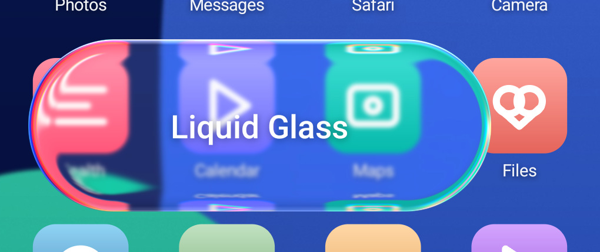
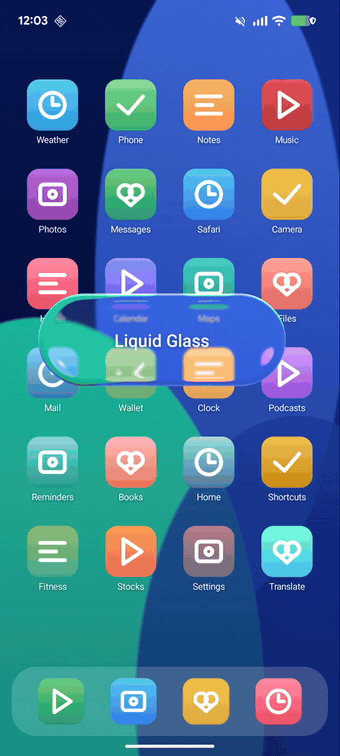
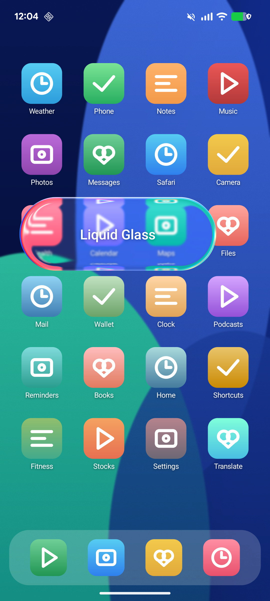
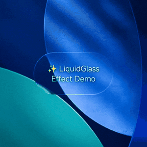
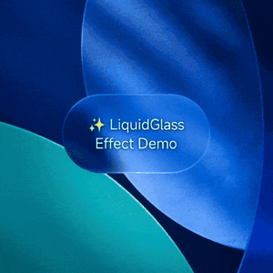
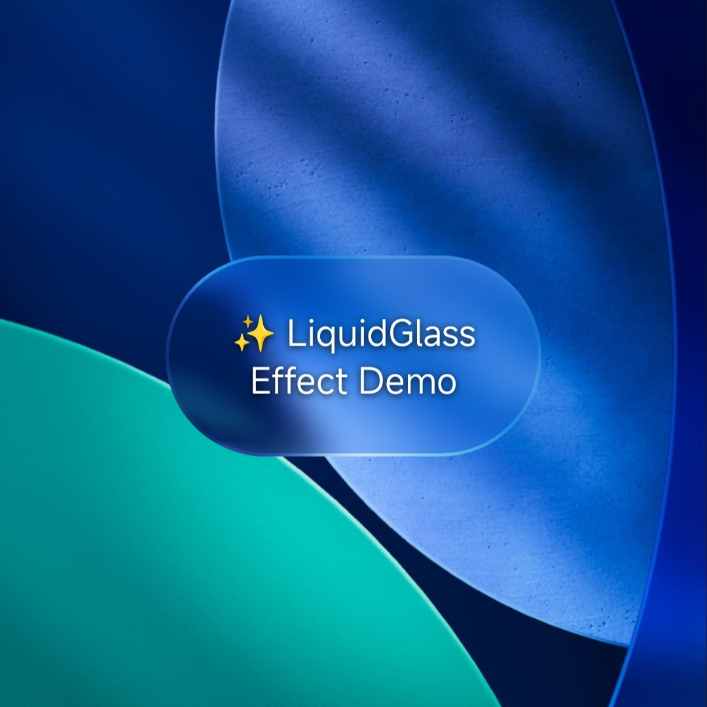
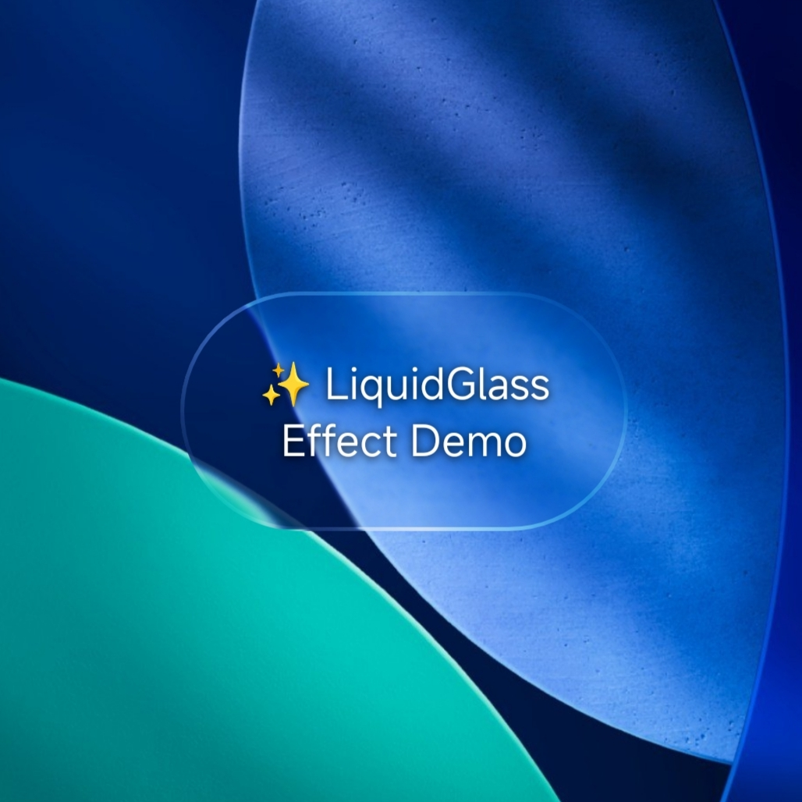

<div align="center">

# LiquidGlass for Android

**iOS 26 Liquid Glass — for the Android View system.**<br>
Real SDF refraction, physical dispersion and sensor-driven specular, in a plain `View`.<br>
Drop it into the View hierarchy you already have. **No Compose migration required.**

**把 iOS 26 的液态玻璃搬到 Android View 体系** —— 真实 SDF 折射 / 物理色散 / 重力感应高光，<br>
一个普通 `View`，直接放进你现有的 View 层级，**不需要迁移到 Compose**。

[](https://jitpack.io/#QWEA0/Liquid-Glass-Android)
[](LICENSE)
[](https://developer.android.com)
[](https://android-arsenal.com/api?level=24)

<br>



<sub>1:1 pixels — the icon grid is <b>compressed into the rim</b> by the SDF lens, with per-channel dispersion fringing the edge.</sub>

<br><br>


&nbsp;&nbsp;


<sub>Recorded on a physical device (Android 16, API 36) — not a mockup.</sub>

<br>

[English](#english) | [中文](#chinese)

</div>

---

<a name="english"></a>

## 🌊 LiquidGlass Android

A high-performance Liquid Glass / glassmorphism component for the Android **View system**, featuring
real-time backdrop blur, SDF refraction, chromatic dispersion and liquid-like interactive effects.

> **Why another one?** The existing Android Liquid Glass libraries target Jetpack Compose.
> Compose adoption is largely *incremental* — most non-greenfield apps run a hybrid tree with
> Compose islands inside an existing View hierarchy — so if the screen you want glass on is still
> a `ViewGroup`, a Compose-only library doesn't help you. `LiquidGlassView` is a `FrameLayout`
> subclass: add it to your layout, put your content inside, done. API 24+, with an AGSL fast path
> on API 33+. (Building greenfield in Compose? Use
> [Kyant0/AndroidLiquidGlass](https://github.com/Kyant0/AndroidLiquidGlass) — it's excellent.)

### ✨ Features

**Liquid Glass 2.0 (API 33+, single-pass AGSL lens pipeline)**

- **🔍 Real SDF Refraction** - True lens optics: edge compression ring driven by a live rounded-rect SDF (follows corner radius & shape in real time)
- **🌈 Physical Dispersion** - Per-channel refraction along the surface normal → spectral fringes at the edge
- **💡 Sensor-Driven Specular** - Normal-based highlights lit by a gravity-sensor light source (highlight moves as you tilt the device)
- **🌓 Adaptive Luminance Tint** - Continuously senses backdrop brightness, adapts glass tint and notifies your foreground content (light/dark)
- **🧪 Regular / Clear Materials** - Apple-style material variants (readability-first vs. media-transparent with dimming layer)
- **🫧 Liquid Merge** - Two glass shapes blend with smin like mercury (`setSecondaryShape`)
- **👆 Liquid Press** - Press boosts refraction and bulges the glass under your finger
- **🌫️ Progressive Blur** - `ScrollEdgeBlurView`: scroll-edge effect fading from sharp to blurred
- **♿ Accessibility Fallback** - Opaque material under high-contrast setting; honors "remove animations" and battery saver

**Classic pipeline (API 24+)**

- **🎨 Real-time Backdrop Blur** - Dynamic background blur with adjustable radius and saturation
- **🌈 Chromatic Aberration** - RGB channel separation effect for a premium glass look
- **✨ Edge Highlights** - Dynamic light reflections based on touch position
- **⚡ High Performance** - Optimized with native C++ (NEON SIMD) and smart caching
- **🎯 Easy Integration** - Simple XML attributes and Kotlin API
- **🔧 Highly Customizable** - Fine-tune every aspect of the glass effect

### 📱 Demo

<div align="center">

#### 🎬 Live drag & parameter tuning




#### 🧪 Regular vs. Clear material




</div>

Run the sample app for the full playground (4 scenes + a live parameter drawer), or launch the
hero scene used for the screenshots at the top:

```bash
adb shell am start -n com.example.liquidglass/com.example.liquidglass.HeroShowcaseActivity
```

### 📦 Installation (JitPack)

Add JitPack to your `settings.gradle.kts`:

```kotlin
dependencyResolutionManagement {
    repositories {
        google()
        mavenCentral()
        maven { url = uri("https://jitpack.io") }
    }
}
```

Add the dependency:

```kotlin
dependencies {
    implementation("com.github.QWEA0.Liquid-Glass-Android:liquidglass:v2.0.0")
}
```

The library ships as the `:liquidglass` module (AAR with prebuilt native `.so` for arm64-v8a / armeabi-v7a); the `:app` module in this repo is the demo.

### 🚀 Quick Start

#### 1. Add to Your Layout

```xml
<com.example.liquidglass.LiquidGlassView
    android:layout_width="200dp"
    android:layout_height="80dp"
    app:blurAmount="0.0625"
    app:saturation="140"
    app:aberrationIntensity="2"
    app:elasticity="0.15"
    app:cornerRadius="999dp"
    app:glassMaterial="regular"
    app:bevelWidth="14dp"
    app:refractionHeight="66dp"
    app:dispersionStrength="0.10"
    app:sensorHighlight="true"
    app:adaptiveTint="true">

    <!-- Your content here -->
    <TextView
        android:layout_width="wrap_content"
        android:layout_height="wrap_content"
        android:text="Glass Button"
        android:textColor="#FFFFFF"
        android:layout_gravity="center" />

</com.example.liquidglass.LiquidGlassView>
```

#### 2. Customize in Code

```kotlin
val glassView = findViewById<LiquidGlassView>(R.id.glassView)

// Enable/disable effects
glassView.enableBackdropBlur = true
glassView.enableChromaticAberration = true
glassView.enableEdgeHighlight = true

// Adjust parameters
glassView.blurAmount = 0.0625f
glassView.saturation = 140f
glassView.aberrationIntensity = 2f
glassView.displacementScale = 70f

// Choose blur method
glassView.blurMethod = BlurMethod.SMART // AUTO, BOX, IIR_GAUSS, DOWNSAMPLE

// Liquid Glass 2.0 (API 33+, auto-fallback below)
glassView.material = GlassMaterial.REGULAR      // or CLEAR
glassView.bevelWidth = 40f                      // glass "thickness" band (px)
glassView.refractionHeight = 200f               // edge refraction strength (px)
glassView.dispersionStrength = 0.10f            // spectral fringe width
glassView.enableSensorHighlight = true          // gravity-driven highlight (default off)
glassView.enableAdaptiveTint = true             // luminance-adaptive tint (default off)
glassView.glassAppearanceListener = { isOverLight ->
    // flip your foreground content color here
}

// Liquid merge (two shapes blending like mercury)
glassView.setPrimaryShape(dockRect, cornerRadiusPx = 36f)
glassView.setSecondaryShape(bubbleRect, cornerRadiusPx = 44f, smoothing = 40f)
```

### 🎛️ Customization Options

| Parameter | Type | Default | Description |
|-----------|------|---------|-------------|
| `displacementScale` | Float | 70 | Edge distortion intensity (classic pipeline) |
| `blurAmount` | Float | 0.0625 | Blur radius (0-1) |
| `saturation` | Float | 140 | Color saturation percentage |
| `aberrationIntensity` | Float | 2 | Chromatic aberration strength |
| `elasticity` | Float | 0.15 | Touch interaction spring effect |
| `cornerRadius` | Float | 999 | Corner radius (999 = pill shape) |
| `enableBackdropBlur` | Boolean | true | Enable background blur |
| `enableChromaticAberration` | Boolean | true | Enable RGB separation |
| `enableEdgeHighlight` | Boolean | true | Enable edge lighting |
| `blurMethod` | Enum | SMART | Blur algorithm selection |
| `material` | Enum | REGULAR | Glass material: REGULAR / CLEAR (API 33+) |
| `bevelWidth` | Float | 40 | Edge bevel band width in px, 2-200 (API 33+) |
| `refractionHeight` | Float | 200 | Max edge refraction in px, 0-300 (API 33+) |
| `dispersionStrength` | Float | 0.10 | Dispersion fringe strength 0-1 (API 33+) |
| `enableSensorHighlight` | Boolean | false | Highlight follows device tilt (API 33+) |
| `enableAdaptiveTint` | Boolean | false | Luminance-adaptive tint (API 33+) |
| `accessibilityMode` | Enum | AUTO | AUTO / FORCE_FULL / FORCE_OPAQUE |

See [docs/LIQUID_GLASS_V2.md](docs/LIQUID_GLASS_V2.md) for the full lens-pipeline documentation.

### 🏗️ Architecture

**Core Components:**
- `LiquidGlassView` - Main view component with touch interaction
- `GlassLensRenderer` - Single-pass AGSL lens pipeline: SDF refraction, dispersion, normal-lit specular, inner shadow, smin merge (API 33+)
- `LightSourceController` - Gravity-sensor world-fixed light source for specular highlights
- `BackdropLuminanceMeter` - Backdrop brightness sampling for adaptive tint
- `ScrollEdgeBlurView` - Progressive blur overlay (scroll edge effect)
- `GlassAccessibility` - Reduce-transparency / reduce-motion / battery-saver detection
- `EnhancedBlurEffect` - Multi-algorithm blur engine (Box, IIR Gaussian, Downsample)
- `ChromaticAberrationEffect` - RGB channel separation processor
- `EdgeHighlightEffect` - Dynamic light reflection renderer (classic pipeline)
- `AsyncRenderer` - Background thread rendering for smooth performance

**Native Optimization:**
- `gauss_iir_neon.cpp` - ARM NEON SIMD accelerated IIR Gaussian blur
- `chromatic_aberration.cpp` - Hardware-accelerated RGB separation
- `boxblur.cpp` - Fast box blur implementation

### 📊 Performance

- **GPU Lens Pipeline (API 33+)**: single-pass AGSL via RenderEffect — zero bitmap allocation, zero readback; ~0.06 ms CPU record cost per frame, steady 60 fps measured on device
- **Optimized Rendering**: Smart caching with 3-layer strategy (backdrop → blur → final)
- **Native Acceleration**: ARM NEON SIMD for 4-8x performance boost (classic pipeline)
- **Adaptive Quality**: Automatic downsampling for smooth 60fps on mid-range devices
- **Memory Efficient**: Bitmap pooling and automatic resource recycling

### 🔧 Requirements

- **Min SDK**: 24 (Android 7.0) — classic pipeline
- **Liquid Glass 2.0 lens pipeline**: API 33+ (Android 13), automatic fallback below
- **Target SDK**: 35 (Android 15)
- **Language**: Kotlin
- **NDK**: Required for native blur acceleration

### 📦 Dependencies

```gradle
dependencies {
    implementation "androidx.core:core-ktx:1.12.0"
    implementation "androidx.appcompat:appcompat:1.6.1"
    implementation "com.google.android.material:material:1.11.0"
}
```

### 🛠️ Build

```bash
# Clone the repository
git clone https://github.com/yourusername/liquidglass-android.git

# Open in Android Studio
# Build and run the demo app
./gradlew assembleDebug
```

### 📄 License

Released under the [MIT License](LICENSE) — free for commercial use, no attribution required beyond keeping the copyright notice.

### 🙏 Credits

Inspired by the glassmorphism design trend and liquid-glass-react library.

---

<a name="chinese"></a>

## 🌊 LiquidGlass Android

一个面向 Android **View 体系**的高性能液态玻璃组件，具有实时背景模糊、SDF 折射、物理色散和液态交互特性。

> **为什么还要再造一个？** 现有的 Android Liquid Glass 库都是给 Jetpack Compose 用的。
> 而 Compose 的落地基本都是*渐进式*的——非全新项目多是混合树，Compose 岛屿嵌在既有的 View
> 层级里——所以只要你想加玻璃的那个界面还是 `ViewGroup`，纯 Compose 的库就帮不上忙。
> `LiquidGlassView` 是一个 `FrameLayout` 子类：放进布局、把内容塞进去，就完事了。
> API 24+，API 33+ 走 AGSL 快速路径。
> （全新项目、纯 Compose？用 [Kyant0/AndroidLiquidGlass](https://github.com/Kyant0/AndroidLiquidGlass)，那个做得很好。）

<p align="center">
  
</p>
### ✨ 特性

**Liquid Glass 2.0（API 33+，单 pass AGSL 透镜管线）**

- **🔍 真实 SDF 折射** - 实时圆角矩形 SDF 驱动的透镜光学：边缘背景压缩环，实时跟随圆角与形状
- **🌈 物理色散** - 三通道沿法线方向不同折射量 → 边缘光谱边纹
- **💡 传感器高光** - 法线光照 + 重力传感器光源，倾斜设备时高光随之移动
- **🌓 亮度自适应** - 持续感知背景明暗，自动调整染色并回调前景内容切换深浅色
- **🧪 Regular / Clear 双材质** - Apple 风格材质变体（重可读性 / 高透+压暗层）
- **🫧 液态融合** - 双玻璃形状 smin 平滑黏连合并（`setSecondaryShape`）
- **👆 按压液态** - 按压增强折射并在手指下方局部凸起
- **🌫️ 渐进模糊** - `ScrollEdgeBlurView`：滚动边缘从清晰渐变到模糊
- **♿ 无障碍降级** - 高对比度设置下退化为不透明材质；尊重「移除动画」与省电模式

**经典管线（API 24+）**

- **🎨 实时背景模糊** - 动态背景模糊，可调节模糊半径和饱和度
- **🌈 色差效果** - RGB 通道分离效果，呈现高级玻璃质感
- **✨ 边缘高光** - 基于触摸位置的动态光线反射
- **⚡ 高性能** - 使用原生 C++ (NEON SIMD) 和智能缓存优化
- **🎯 易于集成** - 简单的 XML 属性和 Kotlin API
- **🔧 高度可定制** - 精细调节玻璃效果的每个方面

完整透镜管线文档见 [docs/LIQUID_GLASS_V2.md](docs/LIQUID_GLASS_V2.md)。

### 📱 演示

<div align="center">

#### 🎬 实时拖动与参数调节


#### 🧪 Regular / Clear 双材质


</div>

跑 sample app 可以看到完整调参场（4 个场景 + 实时参数抽屉），或者直接启动首屏用的 hero 场景：

```bash
adb shell am start -n com.example.liquidglass/com.example.liquidglass.HeroShowcaseActivity
```

### 📦 安装（JitPack）

在 `settings.gradle.kts` 中添加 JitPack 仓库：

```kotlin
dependencyResolutionManagement {
    repositories {
        google()
        mavenCentral()
        maven { url = uri("https://jitpack.io") }
    }
}
```

添加依赖：

```kotlin
dependencies {
    implementation("com.github.QWEA0.Liquid-Glass-Android:liquidglass:v2.0.0")
}
```

库以 `:liquidglass` 模块发布（AAR，内含 arm64-v8a / armeabi-v7a 预编译 `.so`）；仓库中的 `:app` 为演示工程。

### 🚀 快速开始

#### 1. 添加到布局文件

```xml
<com.example.liquidglass.LiquidGlassView
    android:layout_width="200dp"
    android:layout_height="80dp"
    app:blurAmount="0.0625"
    app:saturation="140"
    app:aberrationIntensity="2"
    app:elasticity="0.15"
    app:cornerRadius="999dp"
    app:glassMaterial="regular"
    app:bevelWidth="14dp"
    app:refractionHeight="66dp"
    app:dispersionStrength="0.10"
    app:sensorHighlight="true"
    app:adaptiveTint="true">

    <!-- 在这里放置你的内容 -->
    <TextView
        android:layout_width="wrap_content"
        android:layout_height="wrap_content"
        android:text="玻璃按钮"
        android:textColor="#FFFFFF"
        android:layout_gravity="center" />

</com.example.liquidglass.LiquidGlassView>
```

#### 2. 代码中自定义

```kotlin
val glassView = findViewById<LiquidGlassView>(R.id.glassView)

// 启用/禁用效果
glassView.enableBackdropBlur = true
glassView.enableChromaticAberration = true
glassView.enableEdgeHighlight = true

// 调整参数
glassView.blurAmount = 0.0625f
glassView.saturation = 140f
glassView.aberrationIntensity = 2f
glassView.displacementScale = 70f

// 选择模糊方法
glassView.blurMethod = BlurMethod.SMART // AUTO, BOX, IIR_GAUSS, DOWNSAMPLE

// Liquid Glass 2.0（API 33+，以下版本自动回退）
glassView.material = GlassMaterial.REGULAR      // 或 CLEAR（高透）
glassView.bevelWidth = 40f                      // 玻璃"厚度"斜面带（px）
glassView.refractionHeight = 200f               // 边缘折射强度（px）
glassView.dispersionStrength = 0.10f            // 色散边纹宽度
glassView.enableSensorHighlight = true          // 高光跟随重力传感器（默认关闭）
glassView.enableAdaptiveTint = true             // 背景亮度自适应（默认关闭）
glassView.glassAppearanceListener = { isOverLight ->
    // 在这里切换前景内容深浅色
}

// 液态融合（两个玻璃形状像水银一样黏连合并）
glassView.setPrimaryShape(dockRect, cornerRadiusPx = 36f)
glassView.setSecondaryShape(bubbleRect, cornerRadiusPx = 44f, smoothing = 40f)
```

### 🎛️ 自定义选项

| 参数 | 类型 | 默认值 | 说明 |
|------|------|--------|------|
| `displacementScale` | Float | 70 | 边缘扭曲强度（经典管线） |
| `blurAmount` | Float | 0.0625 | 模糊半径 (0-1) |
| `saturation` | Float | 140 | 颜色饱和度百分比 |
| `aberrationIntensity` | Float | 2 | 色差强度 |
| `elasticity` | Float | 0.15 | 触摸交互弹性效果 |
| `cornerRadius` | Float | 999 | 圆角半径 (999 = 胶囊形状) |
| `enableBackdropBlur` | Boolean | true | 启用背景模糊 |
| `enableChromaticAberration` | Boolean | true | 启用 RGB 分离 |
| `enableEdgeHighlight` | Boolean | true | 启用边缘光效 |
| `blurMethod` | Enum | SMART | 模糊算法选择 |
| `material` | Enum | REGULAR | 玻璃材质：REGULAR / CLEAR（API 33+） |
| `bevelWidth` | Float | 40 | 边缘斜面带宽度 px，2-200（API 33+） |
| `refractionHeight` | Float | 200 | 边缘最大折射位移 px，0-300（API 33+） |
| `dispersionStrength` | Float | 0.10 | 色散强度 0-1（API 33+） |
| `enableSensorHighlight` | Boolean | false | 高光跟随设备倾斜（API 33+） |
| `enableAdaptiveTint` | Boolean | false | 背景亮度自适应染色（API 33+） |
| `accessibilityMode` | Enum | AUTO | AUTO / FORCE_FULL / FORCE_OPAQUE |

### 🏗️ 架构

**核心组件：**
- `LiquidGlassView` - 主视图组件，支持触摸交互
- `GlassLensRenderer` - 单 pass AGSL 透镜管线：SDF 折射、色散、法线高光、内阴影、smin 融合（API 33+）
- `LightSourceController` - 重力传感器世界光源（镜面高光方向）
- `BackdropLuminanceMeter` - 背景亮度采样（自适应染色数据源）
- `ScrollEdgeBlurView` - 渐进模糊覆盖层（Scroll Edge Effect）
- `GlassAccessibility` - 降低透明度/减弱动效/省电模式检测
- `EnhancedBlurEffect` - 多算法模糊引擎（Box、IIR 高斯、降采样）
- `ChromaticAberrationEffect` - RGB 通道分离处理器
- `EdgeHighlightEffect` - 动态光线反射渲染器（经典管线）
- `AsyncRenderer` - 后台线程渲染，保证流畅性能

**原生优化：**
- `gauss_iir_neon.cpp` - ARM NEON SIMD 加速的 IIR 高斯模糊
- `chromatic_aberration.cpp` - 硬件加速的 RGB 分离
- `boxblur.cpp` - 快速盒式模糊实现

### 📊 性能

- **GPU 透镜管线（API 33+）**：单 pass AGSL + RenderEffect——零 Bitmap 分配、零像素回读；真机实测每帧 CPU 录制开销约 0.06ms，稳定 60fps
- **优化渲染**：智能三层缓存策略（背景 → 模糊 → 最终结果）
- **原生加速**：ARM NEON SIMD 提供 4-8 倍性能提升（经典管线）
- **自适应质量**：自动降采样，在中端设备上保持流畅 60fps
- **内存高效**：位图池和自动资源回收

### 🔧 要求

- **最低 SDK**: 24 (Android 7.0) —— 经典管线
- **Liquid Glass 2.0 透镜管线**: API 33+ (Android 13)，以下版本自动回退
- **目标 SDK**: 35 (Android 15)
- **语言**: Kotlin
- **NDK**: 需要用于原生模糊加速

### 📦 依赖

```gradle
dependencies {
    implementation "androidx.core:core-ktx:1.12.0"
    implementation "androidx.appcompat:appcompat:1.6.1"
    implementation "com.google.android.material:material:1.11.0"
}
```

### 🛠️ 构建

```bash
# 克隆仓库
git clone https://github.com/yourusername/liquidglass-android.git

# 在 Android Studio 中打开
# 构建并运行演示应用
./gradlew assembleDebug
```

### 📄 许可证

本项目基于 [MIT 许可证](LICENSE) 发布——可商用，除保留版权声明外无其他要求。

### 🙏 致谢

灵感来源于玻璃态设计趋势和 liquid-glass-react 库。

---

<div align="center">

**Made with ❤️ for Android developers**

**为 Android 开发者用心打造**

</div>
